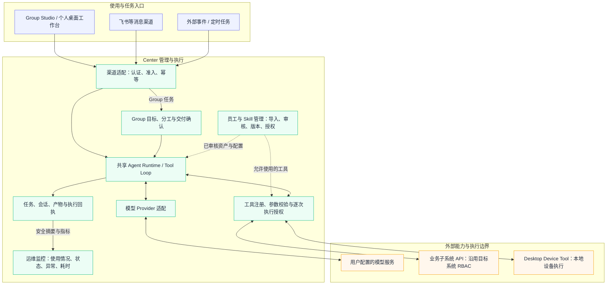

# e-Manager · 企业数字员工管理平台

**让 AI 从单点对话，走向有身份、有权限、有交付的企业数字员工。**

e-Manager 将数字员工、专业技能、业务系统连接和任务交付放在一个管理平台中。员工通过桌面工作台使用能力，管理者集中配置、授权和审核。

## 安装与二次开发

[下载 1.0](https://github.com/ywangeq/e-Manager-public/releases/tag/v1.0.0)：Center 本地启动包、Group Studio 3.x 桌面包（macOS Apple Silicon），以及免费文本摘要 Skill 示例。

本次公开发行 **1.0 对应 Group Studio `3.0.0-beta.32`**。后续开发版本不会自动改变这次发行包；每次发布会单独记录对应版本、源码快照和文件校验值，见 [发行版本对应表](docs/release-versions.md)。

**Center 源码在本仓库。** 前端位于 `src/`，服务端位于 `server/`，Group Studio 位于 `desktop-channel-mvp/`。源码采用独立发布历史。

Center ZIP 需要 **Node.js 24.13+ 和 pnpm 11**。解压后在该目录执行：

```sh
pnpm install --frozen-lockfile --ignore-scripts
pnpm local:install
pnpm start
```

打开 `http://127.0.0.1:14878`，账号 `admin@localhost`，首次密码见本地 `data/local/first-login.txt`。从源码运行时，在启动前执行 `pnpm build`。先启动 Center，再打开 Group Studio；桌面包不自动启动 Center。

**模型 API Key 由用户自行准备。** 仓库和安装包不附带模型密钥，也不提供共享模型额度。启动 Center 后，使用 AI 功能前需配置自己的模型服务地址、模型名称与 API Key；模型调用费用由所用服务商收取。仅启动界面和本地登录不需要模型密钥。请在本机配置凭证，不要提交到 Git 或上传到 Issue。

用户可以配置模型、制作员工和 Skill，或修改源码接入自己的系统。企业认证、组织权限、专有 API 和新增渠道可能需要开发适配，详见 [二次开发说明](docs/secondary-development.md) 和 [本地安装说明](docs/current-state.md)。

桌面包尚未签名或公证，Windows 包未提供。已验证本地登录、基础权限与空目录，完整模型执行和企业接入需按自己的环境联调。

## 产品演示

产品演示 · 4 分 08 秒

https://github.com/user-attachments/assets/c45b4136-bea4-428c-9640-eca8a33b0366

演示展示管理中心、个人驾驶舱、系统连接、运维监控与 Group 协作。影片中的员工、账号、任务和数据为合成演示；流程关系以示意形式呈现，语音唤醒属于未来概念。实际可用能力以交付版本与部署配置为准。

## 各模块能为企业做什么

e-Manager 把员工、技能、系统接入和任务运行放在一起管理。企业可以复用同一套连接和权限机制，让不同岗位的数字员工使用已有业务系统。

| 模块 | 主要作用 | 对企业的帮助 |
| --- | --- | --- |
| Center 管理中心 | 管理组织、用户、员工配置与使用权限 | 集中管理谁能使用哪些员工、由谁负责，减少分散配置 |
| 员工与 Skill 管理 | 导入、审核、版本管理、技能挂载和质量反馈 | 把验证过的能力沉淀为可复用资产，更新时能检查版本和影响范围 |
| 子系统连接与工具 | 注册 API 和允许操作，连接企业已有系统 | 接入能力可供不同员工复用，减少每个业务场景重复开发；操作仍遵循目标系统权限 |
| 共享 Runtime | 统一承接任务、模型与工具调用，记录执行状态和结果 | 桌面、消息、事件和定时入口复用同一执行机制，便于跟踪问题和维护 |
| 个人桌面工作台 | 员工切换、对话、材料提交和任务跟进 | 为员工提供日常使用入口；后续计划集成到 Group Studio |
| Group Studio | 围绕目标组织分工、复核和交付确认 | 把多员工协作放在同一任务中，便于查看进展与确认产物 |
| 渠道与任务入口 | 接入桌面、飞书、外部事件和定时任务 | 让业务在已有入口发起任务，减少在多个应用之间来回操作 |
| 运维与监控 | 查看使用情况、任务状态、异常和执行耗时，支持受控诊断 | 帮助管理员了解平台使用情况，定位任务失败和性能瓶颈，为改进提供依据 |

## 平台架构

下面是逻辑架构，Center 内的模块不代表需要分别部署的微服务。Group Studio、渠道和自动任务共用执行底座；业务系统保留自己的数据与权限。



入口通过认证不等于获得所有工具操作权限：每次工具执行仍需校验操作和授权。运维读取安全摘要与指标；个人桌面工作台集成到 Group Studio 是后续计划。实际执行需要自行配置模型、经审核资产及目标系统权限。

### 子系统如何协作

企业原有系统继续负责自己的数据和业务权限。Center 管理员工、技能和系统连接；数字员工通过受控工具访问已接入系统，将查询结果或操作结果带回任务。

例如，一个员工可以查询业务系统中的记录，再整理成报告；涉及修改数据时，需具备对应工具能力和目标系统授权。Group Studio 可以组织多名员工分工，任务记录与运维视图帮助管理员追踪执行情况。能否完成具体业务，取决于系统接口、已审核资产及实际部署配置。

监控范围以已接入的事件和运行记录为准，并不自动覆盖所有子系统内部指标。诊断执行也需要配置相应员工、技能和授权。

## 企业部署与接入边界

Center 与桌面端需要配套部署。本项目不是下载后即可接入任意企业内网系统的成品：现有企业认证实现绑定 Fortress，业务系统也有各自的接口与授权边界。部署方可自行完成接入，或委托商业交付服务完成。

| 接入项 | 现有能力与配置工作 | 何时需要二次开发 |
| --- | --- | --- |
| 企业登录认证 | 已有 Fortress SSO 登录、票据验证和会话流程；兼容同一接口契约时，配置应用信息、服务地址、回调地址与密钥，并完成联调 | 使用其他 SSO、OIDC、SAML、LDAP 或自建账号体系时，需要认证适配及验证；当前没有可直接切换的通用多协议认证插件 |
| 用户、部门与权限 | 已有身份会话和组织治理逻辑；需要明确用户标识、部门标识、管理员及业务系统权限来源 | 企业目录或权限字段不同，需要适配组织同步、身份映射、账号状态和权限刷新；接入登录并不等于完成权限接入 |
| 模型服务 | 已有 OpenAI Responses 和兼容 Chat Completions 的 Provider 适配；配置匹配的协议、地址、模型与凭证 | 协议、鉴权、流式响应或工具调用格式超出现有支持时，需要 Provider 适配；不能仅凭“OpenAI 兼容”标签保证全部能力可用 |
| 业务系统与内网 API | 已有工具注册与 OpenAPI 执行能力；在既有适配器支持的鉴权和接口范围内，可配置契约、地址、凭证与允许操作 | 专有鉴权、当前用户授权委托、私有协议或特殊数据转换，需要系统适配器或受控 Tool；没有开放接口的系统需要另行评估 |
| 消息渠道 | 已有飞书渠道；需要配置机器人应用、订阅、回调或长连接、权限和 Worker，并验证消息回环 | 其他消息渠道需要渠道适配器；新增飞书机器人通常属于配置与联调 |
| 数字员工与 Skill | 平台提供导入、评审、版本、挂载与运行治理；部署方提供自己的资产并完成审核 | 编写职责、提示词和说明属于资产制作；包含执行脚本、专用工具或新系统操作的 Skill，可能同时需要开发与测试 |
| Center 与桌面部署 | 配置域名、HTTPS、网络、Center 地址、存储与服务进程；桌面包需对应目标 Center 配置并处理签名及分发 | 企业要求不同数据库、密钥管理、部署形态或系统策略，而当前实现不满足时，需要工程适配；现有公司内部安装包不能视为通用外部分发包 |

部署配置、资产制作和平台二次开发是不同的工作。是否需要开发，取决于目标企业的接口和安全要求是否落在现有实现范围内。生产接入仍需验证认证、组织权限、持久化、密钥管理、审计及真实业务回环；本项目不承诺已对任意企业环境完成验证。

商业交付的功能范围、适配系统、部署环境、配套服务和验收标准以双方书面约定为准。

可选行业适配代码保留在源码中；没有对应员工、Skill 和目标系统授权时，不能直接执行业务。企业配置、凭证和运行数据不属于公开交付内容。

## 商业合作

企业部署、系统接入、定制数字员工或商业授权，欢迎联系：

- 邮箱：[wyuan552@gmail.com](mailto:wyuan552@gmail.com)
- GitHub：[@ywangeq](https://github.com/ywangeq)

## 业务资产

1.0 提供平台，不附带现有业务数字员工、Skill 包或企业数据。使用时需要配置模型，并导入自己的员工和技能。

仓库提供一个 [免费文本摘要示例](examples/README.md)，供练习制作和导入 Skill。

后续授权资产优先考虑**服务整个平台的数字员工**，例如辅助自动评审、运维诊断，以及根据企业 SOP 制作员工配置和技能草案；再逐步扩展到各部门的业务数字员工。这些是后续方向，尚未作为资产包交付，审核、发布和高风险操作仍保留相应的人审与权限要求。

各包会注明使用和修改权限；购买资产包是否包含平台商业授权，也会单独说明。具体开发方式见 [二次开发说明](docs/secondary-development.md)。

## 许可证与商业授权

Copyright (c) 2026 ywangeq。

本项目采用 [PolyForm Noncommercial 1.0.0](LICENSE)。可在许可证允许的范围内免费使用、学习和修改；超出该范围的商业使用，请通过以下方式获取书面授权：[wyuan552@gmail.com](mailto:wyuan552@gmail.com)。

具体范围以 [LICENSE](LICENSE) 为准，版权声明见 [NOTICE](NOTICE)。本项目公开源码，该许可证不属于 OSI 认可的开源许可。第三方依赖遵循各自许可证，业务资产包另行注明授权范围。
